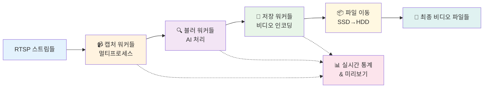
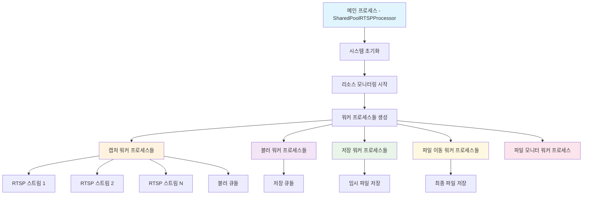
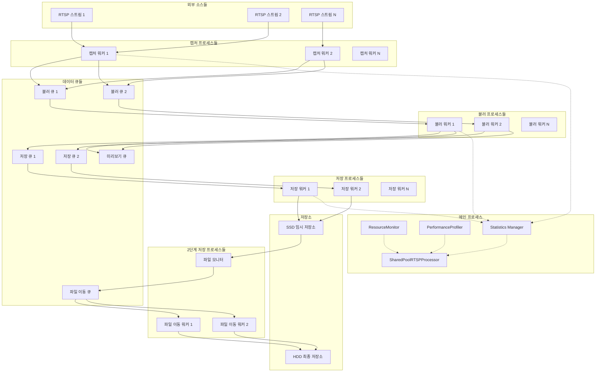
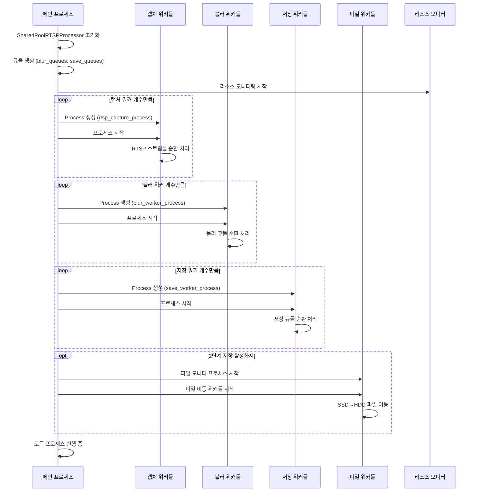

# RTSP Client Module 아키텍처

## 🎯 전체 시스템 흐름도

## 📊 전체 시스템 아키텍처

## 🔄 프로세스 간 데이터 흐름

## ⚙️ 워커 프로세스 생성 시퀀스

## 💾 2단계 저장 시스템

## 🚀 핵심 동작 원리

1. **📥 입력**: 여러 RTSP 스트림 동시 수신
2. **🔄 처리**: 캡처 → 블러링 → 저장 파이프라인
3. **⚡ 병렬화**: 각 단계별 멀티프로세스 처리
4. **💾 최적화**: SSD 임시저장 → HDD 최종저장
5. **📊 모니터링**: 실시간 통계 및 성능 추적

## 📋 핵심 특징

- **🔄 공유 워커 아키텍처**: 각 워커가 모든 스트림을 순환 처리
- **🚀 멀티프로세싱**: CPU 코어 활용 극대화  
- **💾 2단계 저장**: SSD→HDD 최적화된 저장 시스템
- **📈 실시간 모니터링**: 리소스 및 성능 지속 추적
- **🔧 모듈화 설계**: 독립적인 컴포넌트들로 구성

## 🎯 성능 특징

- **멀티프로세스**: CPU 코어 완전 활용
- **파이프라인**: 단계별 병렬 처리
- **큐 기반**: 프로세스 간 안전한 데이터 전달
- **2단계 저장**: I/O 병목 최소화
- **실시간 모니터링**: 성능 최적화 지원